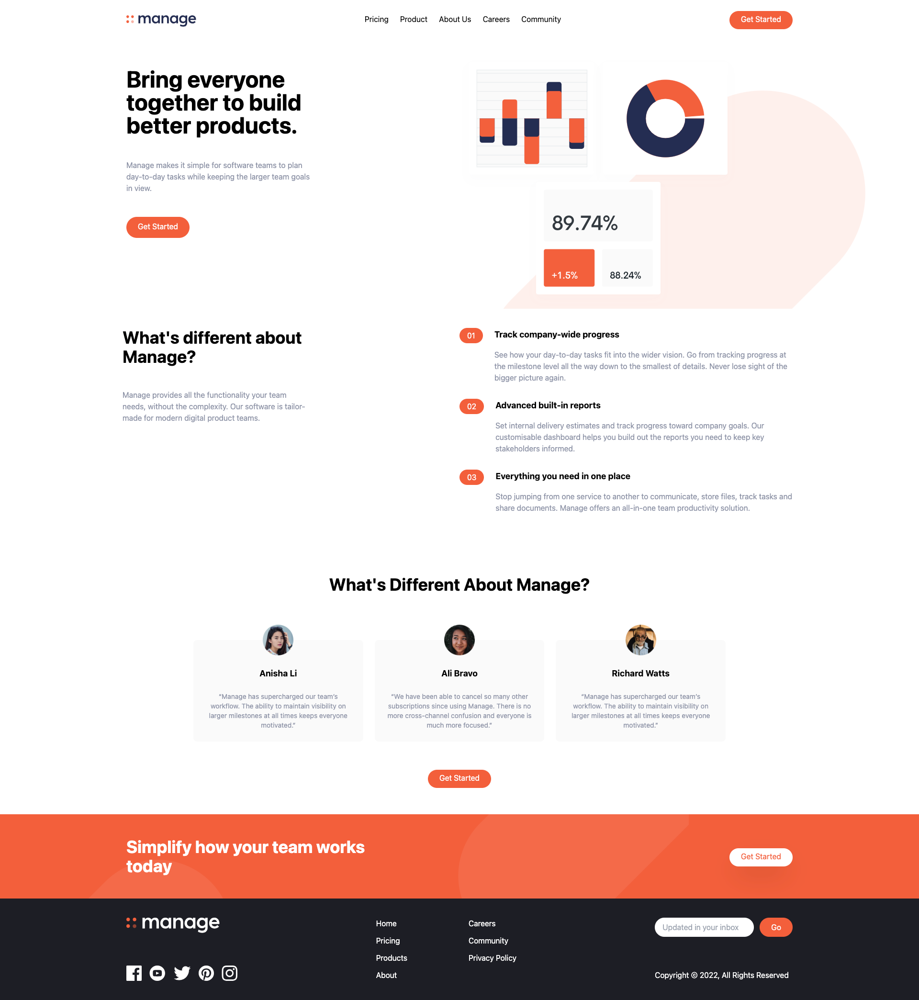
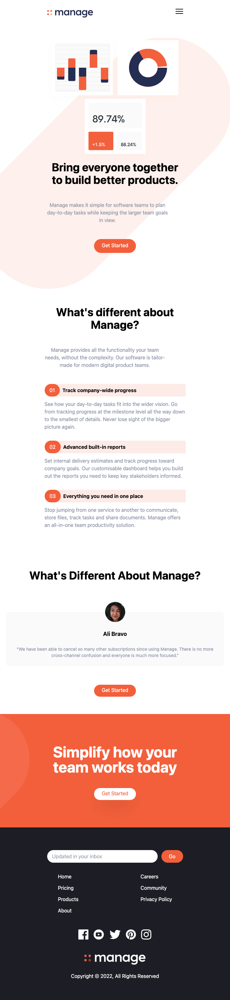

 <h2>About the project</h2>

   
A fully responsive landing page, created with a Tailwind CSS crash course. I've made some improvements to the course. 

👉 Live Demo: <a href='https://tailwind-landing-page-crash-course.vercel.app/'>Live Demo</a>

 <h3>Build with:</h3>

» Typescript
» React JS
» Tailwind CSS

 <h3>Tools:</h3>

» Storybook
» Vite

 <h2>Screenshots of the Project 📸</h2>
  
 

 <h3>Desktop</h3>
 

 <h3>Mobile</h3>
 

 

 <h3 align='left'>Resources</h3>
 <a href='https://www.youtube.com/watch?v=dFgzHOX84xQ&t=1805s'>YouTube</a>
 

